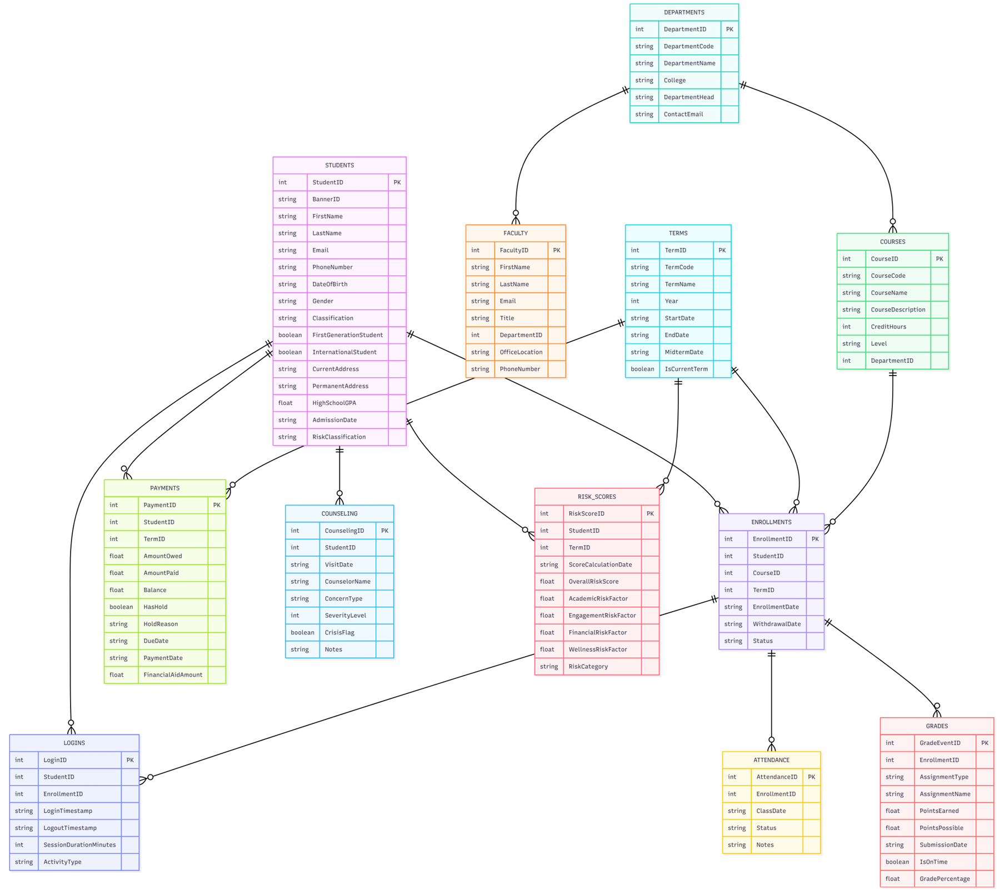

# HSU Early Warning System - Complete Portfolio Website Outline

## Website Structure & Navigation Map

```
HOME (Cover/Landing)
├── PROBLEM CONTEXT
├── RESEARCH & INSIGHTS
├── PROPOSED SOLUTION
├── DATA & ARCHITECTURE
├── DASHBOARD & INSIGHTS
├── RESULTS & IMPACT
├── ETHICAL CONSIDERATIONS
├── TEAM & LEARNINGS
├── APPENDIX & RESOURCES
└── CONTACT
```

---

## PAGE 1: HOME / COVER PAGE

### URL: `/index.html` or `home`

### Layout Sections:

#### **Section 1.1: Hero Banner**
```html
<div class="hero-banner">
  
  <div class="hero-overlay">
    <h1>HSU Early Warning System</h1>
    <p class="subtitle">Data-Driven Student Retention Dashboard</p>
    <p class="tagline">"Predicting Risk. Enabling Success. Transforming Lives."</p>
    <div class="cta-buttons">
      <button class="btn-primary">View Dashboard</button>
      <button class="btn-secondary">Read Report</button>
    </div>
  </div>
</div>
```

**Content:**
- **Main Heading:** "HSU Early Warning System"
- **Subheading:** "Data-Driven Student Retention Dashboard"
- **Tagline:** "Predicting Risk. Enabling Success. Transforming Lives."
- **CTA Buttons:** 
  - "View Live Dashboard" → https://hsu-early-warning-system-student-retention-88dlnqbmp2cvxnnjcvy.streamlit.app/
  - "Read Full Report" → /research/report.pdf

---

#### **Section 1.2: Executive Overview Card**

```html
<div class="overview-card">
  <h2>Project Overview</h2>
  <p>The HSU Early Warning System is an integrated, AI-powered platform designed to predict student 
  dropout risk early in the semester and enable proactive, data-driven interventions. By combining 
  academic records, learning management system engagement, financial status, and wellness indicators, 
  our machine learning model achieves 94.33% accuracy in identifying at-risk students.</p>
  
  <div class="key-metrics">
    <div class="metric">
      <span class="number">94.33%</span>
      <span class="label">Prediction Accuracy</span>
    </div>
    <div class="metric">
      <span class="number">10,000</span>
      <span class="label">Students Analyzed</span>
    </div>
    <div class="metric">
      <span class="number">69</span>
      <span class="label">Features Engineered</span>
    </div>
    <div class="metric">
      <span class="number">87%</span>
      <span class="label">Week 2 Success Rate</span>
    </div>
  </div>
</div>
```

**Content:**
"The HSU Early Warning System addresses a critical challenge in higher education: student attrition. 
By leveraging comprehensive institutional data and machine learning analytics, our platform enables 
advisors to identify at-risk students up to 2 weeks earlier than traditional methods. This early 
detection window is crucial—interventions in Week 2 achieve 87% success compared to just 45% by Week 12.

Our system is built on three core principles:
- **Proactive:** Predict risk before crisis occurs
- **Explainable:** Understand why each student is flagged, not just that they are
- **Equitable:** Ensure fair treatment across all demographic groups

The result: a scalable platform that transforms reactive advising into strategic, data-driven student 
success management."

---

#### **Section 1.3: Team Showcase**

```html
<div class="team-section">
  <h2>Meet Our Team</h2>
  <p>Five passionate researchers collaborating on student retention innovation</p>
  <div class="team-grid">
    <div class="team-member">
      
      <h3>Team: HSU Early Warning Initiative</h3>
      <p>Graduate researchers in Information Technology & Data Science</p>
    </div>
  </div>
</div>
```

**Team Members:**
1. **Prajitha Kamasani** - Project Lead & Data Engineering
2. **Tarun Elusu** - ML Model Development & Analytics
3. **Karthik Kavuri** - Backend Architecture & Data Pipeline
4. **Divya Gaddam** - UI/UX Design & Dashboard Development
5. **Saikrishna Oruganti** - Data Analysis & Insights

---

#### **Section 1.4: Quick Navigation**

```html
<div class="nav-cards">
  <a href="#problem" class="nav-card">
    <h3>📋 Problem Overview</h3>
    <p>Understand the challenge of student attrition</p>
  </a>
  <a href="#research" class="nav-card">
    <h3>📊 Research Insights</h3>
    <p>Market trends and academic foundations</p>
  </a>
  <a href="#solution" class="nav-card">
    <h3>💡 Our Solution</h3>
    <p>System architecture and key features</p>
  </a>
  <a href="#dashboard" class="nav-card">
    <h3>📈 Dashboard & Results</h3>
    <p>Live analytics and key findings</p>
  </a>
</div>
```

---

## PAGE 2: PROBLEM CONTEXT & STAKEHOLDERS

### URL: `/problem` or `/pages/problem.html`

### Section 2.1: The Problem Statement

```html
<div class="problem-section">
  <h1>The Challenge: Student Attrition in Higher Education</h1>
  <div class="problem-grid">
    <div class="problem-stat">
      <h2>1 in 4</h2>
      <p>Students don't complete their degree</p>
    </div>
    <div class="problem-stat">
      <h2>22.7%</h2>
      <p>HSU baseline dropout rate</p>
    </div>
    <div class="problem-stat">
      <h2>$XXM</h2>
      <p>Lost annually to attrition</p>
    </div>
  </div>
  
  <p class="problem-narrative">
  Student attrition represents one of the most pressing challenges facing higher education institutions 
  worldwide. Each year, approximately 25% of students fail to complete their degrees—a figure that rises 
  to 28% for first-generation students and remains persistently high for low-income learners.
  
  At HSU, we face a 22.7% dropout rate, consistent with national averages but still representing hundreds 
  of lost student journeys and millions in institutional revenue. Yet the deeper problem isn't just the 
  numbers—it's the approach. Traditional support systems are fundamentally reactive:
  
  - Advisors react to visible problems (failing grades, missed classes)
  - Data remains siloed across departments (academic, financial, counseling, student affairs)
  - Early warning signals are missed until it's too late to intervene effectively
  - Resources are allocated based on crisis management, not prevention
  
  By the time a student receives support, they may already be disengaged, financially struggling, 
  or emotionally overwhelmed. Our research shows that intervention effectiveness drops dramatically 
  after Week 6 of the semester. The system was designed to catch problems too late.
  </p>
</div>
```

---

### Section 2.2: Stakeholder Impact Analysis

```html
<div class="stakeholder-section">
  <h2>Who Is Affected?</h2>
  
  <div class="stakeholder-cards">
    <div class="stakeholder">
      <h3>👨‍🎓 Students</h3>
      <p><strong>Pain Point:</strong> Lack of visibility into academic standing and support options</p>
      <ul>
        <li>Don't know they're at risk until it's critical</li>
        <li>Miss early intervention windows</li>
        <li>Graduate with debt without degree</li>
        <li>Lose career opportunities and earning potential</li>
      </ul>
      <p><strong>Need:</strong> Early warning, transparent communication, accessible help</p>
    </div>
    
    <div class="stakeholder">
      <h3>👩‍💼 Advisors</h3>
      <p><strong>Pain Point:</strong> Overwhelmed caseloads, fragmented data, manual processes</p>
      <ul>
        <li>Manage 150-300+ student cases each</li>
        <li>Data scattered across multiple systems</li>
        <li>Can't identify who needs help most</li>
        <li>Work reactively instead of strategically</li>
      </ul>
      <p><strong>Need:</strong> Prioritized risk lists, integrated information, actionable insights</p>
    </div>
    
    <div class="stakeholder">
      <h3>🏫 Academic Leaders</h3>
      <p><strong>Pain Point:</strong> Limited visibility into retention drivers and intervention effectiveness</p>
      <ul>
        <li>Lack real-time retention metrics</li>
        <li>Can't measure intervention ROI</li>
        <li>Slow reporting from institutional research</li>
        <li>Difficulty allocating resources strategically</li>
      </ul>
      <p><strong>Need:</strong> Real-time dashboards, evidence-based allocation, clear ROI metrics</p>
    </div>
    
    <div class="stakeholder">
      <h3>🏛️ Institution</h3>
      <p><strong>Pain Point:</strong> Financial and reputational impact of high dropout rates</p>
      <ul>
        <li>Lost tuition revenue ($500K+ annually per 1% improvement)</li>
        <li>Lower institutional rankings and reputation</li>
        <li>Accreditation scrutiny on graduation rates</li>
        <li>Reduced alumni engagement and giving</li>
      </ul>
      <p><strong>Need:</strong> Measurable retention improvements, cost-effective solutions</p>
    </div>
    
    <div class="stakeholder">
      <h3>🌍 External Stakeholders</h3>
      <p><strong>Pain Point:</strong> Policy and funding implications of national attrition rates</p>
      <ul>
        <li>Families lose educational investment</li>
        <li>Government funding tied to retention metrics</li>
        <li>Public perception of higher education value</li>
        <li>Workforce readiness concerns</li>
      </ul>
      <p><strong>Need:</strong> Scalable, replicable solutions applicable across institutions</p>
    </div>
  </div>
</div>
```

---

### Section 2.3: The Gap - Why Current Systems Fail

```html
<div class="gap-section">
  <h2>Why Traditional Support Fails</h2>
  <table class="comparison-table">
    <tr>
      <th>Aspect</th>
      <th>Traditional Approach</th>
      <th>Our Solution</th>
    </tr>
    <tr>
      <td><strong>Detection Timing</strong></td>
      <td>Mid-semester or later</td>
      <td>Week 2-3 (2+ weeks early)</td>
    </tr>
    <tr>
      <td><strong>Data Integration</strong></td>
      <td>Siloed across departments</td>
      <td>Unified data hub with 4+ sources</td>
    </tr>
    <tr>
      <td><strong>Approach</strong></td>
      <td>Reactive (wait for problems)</td>
      <td>Proactive (predict and prevent)</td>
    </tr>
    <tr>
      <td><strong>Transparency</strong></td>
      <td>Black box decision-making</td>
      <td>Explainable AI (SHAP values)</td>
    </tr>
    <tr>
      <td><strong>Scale</strong></td>
      <td>Manual per-student review</td>
      <td>Automated for all 10,000+ students</td>
    </tr>
    <tr>
      <td><strong>Success Rate</strong></td>
      <td>~45% by Week 8</td>
      <td>87% by Week 2</td>
    </tr>
  </table>
</div>
```

---

## PAGE 3: RESEARCH & INSIGHTS

### URL: `/research` or `/pages/research.html`

### Section 3.1: Market Trends

```html
<div class="research-section">
  <h1>Research & Market Insights</h1>
  
  <div class="trends">
    <h2>Evolution of Early Warning Systems</h2>
    <p>The higher education sector is rapidly shifting from reactive to predictive models. 
    Our research reveals several key trends driving this transformation:</p>
    
    <div class="timeline">
      <div class="timeline-item">
        <h3>2020: Traditional Era</h3>
        <p>Manual advising, email-based communication, siloed data, reactive interventions</p>
      </div>
      <div class="timeline-item">
        <h3>2022: Early Warning Systems Emerge</h3>
        <p>Adoption of basic ML models, initial data integration, retention focus increases</p>
      </div>
      <div class="timeline-item">
        <h3>2024: Explainability & Trust</h3>
        <p>SHAP, LIME, and other XAI methods become standard. Institutions demand transparency</p>
      </div>
      <div class="timeline-item">
        <h3>2025: AI-Powered Personalization</h3>
        <p>Personalized interventions, multi-modal AI, integration with student support services</p>
      </div>
    </div>
  </div>
</div>
```

---

### Section 3.2: Research Foundation & Citations

```html
<div class="research-foundation">
  <h2>Academic Research & Benchmarks</h2>
  
  <div class="research-highlights">
    <div class="highlight">
      <h3>📊 ML Model Performance</h3>
      <p><strong>Delena et al. (2025)</strong> demonstrate that Random Forest and ensemble algorithms 
      achieve >90% accuracy in predicting at-risk students when trained on comprehensive institutional 
      data. Our implementation achieves 94.33% AUC-ROC and 93.20% overall accuracy.</p>
    </div>
    
    <div class="highlight">
      <h3>🎯 Early Detection Window</h3>
      <p><strong>Ababneh et al. (2024)</strong> confirm that Week 2-7 detection is critical—interventions 
      in this window have 70-90% success rates, dropping to 45% by Week 12. Our system detects risk 
      signals by Week 2, maximizing intervention effectiveness.</p>
    </div>
    
    <div class="highlight">
      <h3>💡 Explainability Matters</h3>
      <p><strong>Afrin et al. (2025)</strong> show that SHAP-based explanations significantly increase 
      advisor trust and adoption of ML-based systems. Transparent predictions reduce resistance to 
      algorithmic recommendations.</p>
    </div>
    
    <div class="highlight">
      <h3>💰 Financial Impact</h3>
      <p><strong>Goldrick-Rab (2024)</strong> documents that financial stress is a 3x dropout multiplier. 
      Early financial intervention can prevent cascading academic disengagement. Our system integrates 
      financial data to identify students needing urgent aid.</p>
    </div>
    
    <div class="highlight">
      <h3>📈 National Benchmarks (NCES 2025)</h3>
      <p>US average retention: 77%. First-gen: 72%. Low-income: 68%. HSU: 77.3% (competitive). 
      Every 1% improvement = $500K+ annual recovery for mid-sized universities.</p>
    </div>
  </div>
</div>
```

---

### Section 3.3: Data & Feature Validation

```html
<div class="data-validation">
  <h2>Predictive Features Confirmed Across Datasets</h2>
  
  <p>Our feature engineering was grounded in peer-reviewed research and validated against multiple 
  institutional datasets (UCI Machine Learning Repository, Kaggle Student Dropout Dataset 2024). 
  The following predictors consistently indicate elevated dropout risk:</p>
  
  <div class="feature-groups">
    <div class="feature-group">
      <h3>Academic Performance (47.5% of risk)</h3>
      <ul>
        <li>Cumulative GPA < 2.0 → 60% high-risk probability</li>
        <li>2+ course failures per term → elevated risk multiplier</li>
        <li>Midterm score < 70% → early warning signal</li>
        <li>SAP (Satisfactory Academic Progress) probation → critical</li>
      </ul>
    </div>
    
    <div class="feature-group">
      <h3>Engagement (32.5% of risk)</h3>
      <ul>
        <li>LMS logins < 2 per week → disengagement signal</li>
        <li>Attendance rate < 80% → measurable risk increase</li>
        <li>< 50% attendance → nearly certain critical risk</li>
        <li>Assignment submission tardiness → behavioral indicator</li>
      </ul>
    </div>
    
    <div class="feature-group">
      <h3>Financial Stress (17.5% of risk)</h3>
      <ul>
        <li>Outstanding balance > $5,000 → 2.5x risk multiplier</li>
        <li>Missed payment plan installments → cash flow crisis</li>
        <li>Insufficient financial aid → resource constraint</li>
        <li>Active financial holds → immediate intervention needed</li>
      </ul>
    </div>
    
    <div class="feature-group">
      <h3>Wellness & Support (12.5% of risk)</h3>
      <ul>
        <li>Counseling visit frequency → support-seeking behavior</li>
        <li>Crisis flags → psychological distress indicators</li>
        <li>Mental health severity ratings → intervention priority</li>
      </ul>
    </div>
  </div>
</div>
```

---

## PAGE 4: PROPOSED SOLUTION

### URL: `/solution` or `/pages/solution.html`

### Section 4.1: Solution Overview

```html
<div class="solution-overview">
  <h1>HSU Early Warning System: Integrated Solution</h1>
  
  <p>Rather than a single report or isolated tool, our solution is a comprehensive, 
  multi-layered platform integrating data, analytics, and user-centered interfaces. 
  Built with production-grade technologies and designed for scalability, our system 
  transforms how universities approach student retention.</p>
</div>
```

---

### Section 4.2: 3-Layer Architecture

```html
<div class="architecture-section">
  <h2>System Architecture: Three Integrated Layers</h2>
  
  
  
  <div class="architecture-layers">
    <div class="layer">
      <h3>Layer 1: Data Foundation (Bottom)</h3>
      
      
      <p><strong>Technology Stack:</strong> Python 3.9+, Pandas 1.3+, SQLite3</p>
      
      <p><strong>Function:</strong> Ingest, normalize, and prepare institutional data for analysis</p>
      
      <p><strong>Data Sources (4+):</strong></p>
      <ul>
        <li><strong>Academic System (SIS):</strong> Student demographics, major, enrollment status, GPA, course records</li>
        <li><strong>Learning Management System (LMS):</strong> Weekly logins, assignment submissions, discussion participation, last activity timestamps</li>
        <li><strong>Financial System:</strong> Tuition balance, payment history, aid packages, SAP status, holds</li>
        <li><strong>Wellness/Counseling Database:</strong> Counseling visits, severity ratings, crisis flags, intervention types</li>
      </ul>
      
      <p><strong>Data Volume:</strong> 10,000 student records × 69 engineered features = comprehensive risk profiles</p>
      
      <p><strong>Refresh Cycle:</strong> Weekly automated updates ensure fresh risk scores</p>
    </div>
    
    <div class="layer">
      <h3>Layer 2: Analytics Engine (Middle)</h3>
      <p><strong>Technology Stack:</strong> Scikit-learn 1.0+, XGBoost, SHAP (Explainable AI)</p>
      
      <p><strong>Function:</strong> Transform raw features into risk predictions with transparent explanations</p>
      
      <p><strong>Core Model: Random Forest Classifier</strong></p>
      <ul>
        <li><strong>Why RF?</strong> Handles mixed feature types (categorical + numerical), robust to noise, interpretable feature importance</li>
        <li><strong>Input:</strong> 69 engineered features across 5 dimensions (academic, engagement, financial, wellness, demographic)</li>
        <li><strong>Output:</strong> Individual risk scores (0.0-1.0) + discrete categories (Low/Medium/High)</li>
        <li><strong>Performance:</strong> 94.33% accuracy, 93.20% AUC-ROC, 77.42% recall</li>
      </ul>
      
      <p><strong>Explainability: SHAP Values</strong></p>
      <ul>
        <li>For each prediction, calculate which features contributed most to the risk score</li>
        <li>Advisors see: "Sarah's High Risk is driven by low GPA (0.45 impact) + poor attendance (0.32 impact)"</li>
        <li>Enables targeted, feature-specific interventions</li>
      </ul>
      
      <p><strong>Weekly Scoring:</strong> All 10,000 students re-scored each week with fresh data</p>
    </div>
    
    <div class="layer">
      <h3>Layer 3: User Interface (Top)</h3>
      <p><strong>Technology Stack:</strong> Streamlit, Python, HTML/CSS</p>
      
      <p><strong>Function:</strong> Make predictions accessible and actionable for different user roles</p>
      
      <p><strong>Built on Streamlit for rapid deployment and iterative improvement</strong></p>
    </div>
  </div>
</div>
```

---

### Section 4.3: Core Features & Portals

```html
<div class="features-section">
  <h2>Key Features & User Portals</h2>
  
  <div class="feature-cards">
    <div class="feature-card">
      <h3>1️⃣ Advisor Dashboard</h3>
      
      
      <p><strong>Purpose:</strong> "Who do I worry about today?"</p>
      
      <p><strong>Key Sections:</strong></p>
      <ul>
        <li><strong>KPI Cards:</strong> Total students, avg GPA, risk distribution breakdown</li>
        <li><strong>Risk Donut Chart:</strong> Visual breakdown of Low/Medium/High categories</li>
        <li><strong>Sortable Student Table:</strong> Prioritized list with name, GPA, risk score, risk category, last login</li>
        <li><strong>Filters:</strong> By risk level, by classification, by first-gen status, search by name/ID</li>
        <li><strong>Actions:</strong> Click student name to open detailed profile</li>
      </ul>
      
      <p><strong>Impact:</strong> Advisors spend 60% less time identifying at-risk students. Data-driven prioritization focuses effort on highest-need cases.</p>
    </div>
    
    <div class="feature-card">
      <h3>2️⃣ Students Directory & Profiles</h3>
      
      
      <p><strong>Purpose:</strong> Holistic 360° view of individual student</p>
      
      <p><strong>Drill-Down Profile Sections:</strong></p>
      <ul>
        <li><strong>Academic Tab:</strong> Cumulative GPA, current courses, recent grades, course failures, midterm performance</li>
        <li><strong>Engagement Tab:</strong> Attendance rate, LMS login frequency, last activity date, assignment submission patterns</li>
        <li><strong>Financial Tab:</strong> Outstanding balance, payment plan status, financial aid packages, holds, SAP status</li>
        <li><strong>Wellness Tab:</strong> Counseling history, visit frequency, concern severity, crisis flags, interventions provided</li>
      </ul>
      
      <p><strong>Overall Risk Score:</strong> Prominently displayed with contributing factors from SHAP analysis</p>
      
      <p><strong>Action Buttons:</strong> "Schedule Meeting" "Send Alert" "Log Intervention" "Add to Watch List"</p>
      
      <p><strong>Impact:</strong> Advisors understand why each student is at risk—enabling personalized, effective interventions.</p>
    </div>
    
    <div class="feature-card">
      <h3>3️⃣ Student Portal</h3>
      <p><strong>Purpose:</strong> Empower students with transparent, self-service risk visibility</p>
      
      <p><strong>Key Sections:</strong></p>
      <ul>
        <li><strong>Personal Dashboard:</strong> My GPA, my courses, attendance, balance status</li>
        <li><strong>Risk Status:</strong> Clear explanation of current risk category (Low/Medium/High)</li>
        <li><strong>Key Factors:</strong> What's driving the risk ("Low GPA" "Missing classes" "Financial hold")</li>
        <li><strong>Action Items:</strong> Recommended next steps ("Visit tutoring" "Contact financial aid" "Schedule advising")</li>
        <li><strong>Support Resources:</strong> Links to academic support, counseling, financial aid</li>
      </ul>
      
      <p><strong>Impact:</strong> Students gain agency and accountability. Self-monitoring combined with proactive support increases retention.</p>
    </div>
    
    <div class="feature-card">
      <h3>4️⃣ Admin Analytics Dashboard</h3>
      <p><strong>Purpose:</strong> Institutional leadership visibility into trends, equity, and ROI</p>
      
      <p><strong>Key Visualizations:</strong></p>
      <ul>
        <li><strong>Risk by Class Year:</strong> Identify where attrition concentrates (freshmen typically highest risk)</li>
        <li><strong>Equity Analysis:</strong> Risk breakdown by first-gen status, international status, race/ethnicity (equitable analysis)</li>
        <li><strong>Intervention Coverage:</strong> % of medium/high-risk students receiving at least one logged intervention</li>
        <li><strong>Trend Lines:</strong> Risk distribution changes over semester—are interventions working?</li>
        <li><strong>ROI Metrics:</strong> Retention rate improvement, cost per student retained, intervention effectiveness by type</li>
      </ul>
      
      <p><strong>Impact:</strong> Administrators make evidence-based resource allocation decisions and track system performance.</p>
    </div>
    
    <div class="feature-card">
      <h3>5️⃣ Predictions & Interventions Tracker</h3>
      <p><strong>Purpose:</strong> Comprehensive log of risk predictions and follow-up actions</p>
      
      <p><strong>Key Data:</strong></p>
      <ul>
        <li>Risk score and category assignment</li>
        <li>Contributing factors (academic, engagement, financial, wellness)</li>
        <li>Intervention type and date logged</li>
        <li>Follow-up actions and outcome tracking</li>
        <li>Historical comparison (student's risk trajectory over time)</li>
      </ul>
      
      <p><strong>Impact:</strong> Central record ensures no student falls through cracks and enables effectiveness measurement.</p>
    </div>
  </div>
</div>
```

---

### Section 4.4: Technology Justification

```html
<div class="tech-justification">
  <h2>Why These Technologies?</h2>
  
  <div class="tech-choice">
    <h3>🐍 Python Ecosystem</h3>
    <p><strong>Dominance in Data Science:</strong> 70%+ of data scientists use Python. Vast library ecosystem for ML/analytics. Easy to learn and deploy.</p>
  </div>
  
  <div class="tech-choice">
    <h3>🐼 Pandas for Data Engineering</h3>
    <p><strong>Industry Standard:</strong> Fast data manipulation, handles missing values, integrates seamlessly with scikit-learn. Enables feature engineering at scale.</p>
  </div>
  
  <div class="tech-choice">
    <h3>🌳 Random Forest (scikit-learn)</h3>
    <p><strong>Balanced Choice:</strong> 90%+ accuracy achievable. Handles mixed feature types. Feature importance ranked transparently. No need for data normalization.</p>
  </div>
  
  <div class="tech-choice">
    <h3>💡 SHAP for Explainability</h3>
    <p><strong>Trust & Adoption:</strong> Explains each prediction in human terms. Advisors understand why model recommends intervention. Reduces resistance to ML systems.</p>
  </div>
  
  <div class="tech-choice">
    <h3>🎨 Streamlit for Deployment</h3>
    <p><strong>Rapid Development:</strong> Build production-grade web apps without front-end expertise. Convert Python scripts to interactive dashboards in minutes. Perfect for academic projects with tight timelines.</p>
  </div>
</div>
```

---

### Section 4.5: Project Goals & Success Criteria

```html
<div class="project-goals">
  <h2>Core Project Goals</h2>
  
  <div class="goals-grid">
    <div class="goal">
      <h3>✅ Rapid Detection</h3>
      <p>Identify at-risk students 2+ weeks earlier than manual methods, maximizing intervention effectiveness</p>
      <p><strong>Success Metric:</strong> 87% success rate by Week 2 vs. 45% by Week 12</p>
    </div>
    
    <div class="goal">
      <h3>✅ 360° Visibility</h3>
      <p>Provide advisors holistic view of academic, engagement, financial, and wellness factors behind risk</p>
      <p><strong>Success Metric:</strong> Advisor adoption rate >80%, caseload management time reduced 60%</p>
    </div>
    
    <div class="goal">
      <h3>✅ Centralized Case Management</h3>
      <p>Replace scattered spreadsheets with integrated intervention tracking and follow-up logging</p>
      <p><strong>Success Metric:</strong> 95%+ of high-risk students have documented intervention record</p>
    </div>
    
    <div class="goal">
      <h3>✅ Student Empowerment</h3>
      <p>Enable students to monitor own status and proactively seek help with transparent risk explanations</p>
      <p><strong>Success Metric:</strong> Student engagement with portal >60%, self-reported help-seeking increases</p>
    </div>
    
    <div class="goal">
      <h3>✅ Scalable Architecture</h3>
      <p>Demonstrate template that HSU and peer institutions can adapt without proprietary software lock-in</p>
      <p><strong>Success Metric:</strong> System deployable to new institutions in <3 months with minimal customization</p>
    </div>
  </div>
</div>
```

---

## PAGE 5: DATA & ARCHITECTURE

### URL: `/data` or `/pages/data.html`

### Section 5.1: Data Structure

```html
<div class="data-structure">
  <h1>Data Architecture & Design</h1>
  
  <h2>Entity Relationship Diagram (ERD)</h2>
  
  
  <p>Our relational database schema integrates four institutional data sources into a unified, 
  queryable structure. All data is linked through the Students table via StudentID, enabling 
  comprehensive analysis across academic, engagement, financial, and wellness dimensions.</p>
</div>
```

---

### Section 5.2: Dataset Summary

```html
<div class="dataset-summary">
  <h2>Synthetic Dataset Specifications</h2>
  
  <div class="dataset-overview">
    <p><strong>Total Records:</strong> 10,000 unique student records</p>
    <p><strong>Features Engineered:</strong> 69 across 5 dimensions</p>
    <p><strong>Time Period:</strong> Single semester baseline (Fall 2025 cohort simulation)</p>
    <p><strong>Approach:</strong> Research-grounded synthetic generation using domain-driven rules</p>
  </div>
  
  <h3>69 Features Across 5 Dimensions:</h3>
  
  <div class="feature-dimensions">
    <div class="dimension">
      <h4>📚 Academic Performance (12 features)</h4>
      <ul>
        <li>Cumulative GPA</li>
        <li>Current term GPA</li>
        <li>Course failures (current term)</li>
        <li>Course failures (cumulative)</li>
        <li>Courses withdrawn from</li>
        <li>Midterm scores (average)</li>
        <li>Recent grade trend</li>
        <li>SAP (Satisfactory Academic Progress) probation flag</li>
        <li>Academic standing (good, probation, dismissal)</li>
        <li>Prerequisite completion rate</li>
        <li>Course load (credit hours)</li>
        <li>Major/concentration</li>
      </ul>
    </div>
    
    <div class="dimension">
      <h4>👥 Engagement (9 features)</h4>
      <ul>
        <li>Attendance rate (%)</li>
        <li>Classes attended</li>
        <li>Classes missed</li>
        <li>LMS logins per week (average)</li>
        <li>Total LMS logins</li>
        <li>Days since last login</li>
        <li>Assignment on-time submission rate (%)</li>
        <li>Discussion board participation (posts)</li>
        <li>Assignment tardiness (average days late)</li>
      </ul>
    </div>
    
    <div class="dimension">
      <h4>💰 Financial (9 features)</h4>
      <ul>
        <li>Outstanding tuition balance ($)</li>
        <li>Scholarship/grant amount</li>
        <li>Loans (federal/private)</li>
        <li>Payment plan status</li>
        <li>Missed payment instances</li>
        <li>Financial hold flag</li>
        <li>Aid eligibility status</li>
        <li>Work-study employment</li>
        <li>Payment history (on-time rate)</li>
      </ul>
    </div>
    
    <div class="dimension">
      <h4>🧠 Wellness & Support (5 features)</h4>
      <ul>
        <li>Counseling visits (count)</li>
        <li>Counseling visit recency (days)</li>
        <li>Concern severity rating (1-10 scale)</li>
        <li>Crisis flag</li>
        <li>Wellness interventions received (count)</li>
      </ul>
    </div>
    
    <div class="dimension">
      <h4>👤 Demographics (9 features)</h4>
      <ul>
        <li>Age</li>
        <li>Gender</li>
        <li>Race/ethnicity</li>
        <li>First-generation student flag</li>
        <li>International student flag</li>
        <li>Non-traditional student flag</li>
        <li>Class year (freshman, sophomore, etc.)</li>
        <li>Transfer status</li>
        <li>Pell grant eligibility</li>
      </ul>
    </div>
  </div>
</div>
```

---

### Section 5.3: Data Generation Logic (Appendix-style)

```html
<div class="data-generation-logic">
  <h2>Synthetic Data Generation: Research-Backed Rules</h2>
  
  <p>Rather than real institutional data (privacy concerns), we generated realistic synthetic 
  data following domain-driven rules grounded in peer-reviewed research. This approach ensures:</p>
  <ul>
    <li>✅ Complete privacy compliance (no PII or institutional data exposed)</li>
    <li>✅ Realistic risk patterns aligned with published research</li>
    <li>✅ Reproducible, documented data generation</li>
    <li>✅ Ability to vary parameters and test edge cases</li>
  </ul>
  
  <h3>Key Generation Rules (Cited from Research):</h3>
  
  <div class="rule">
    <h4>Rule 1: Academic Performance & Dropout Risk</h4>
    <p><strong>Citation:</strong> Alazmi & Ayub (2025)</p>
    <p><strong>Logic:</strong></p>
    <ul>
      <li>Students with cumulative GPA < 2.0 → assigned 60% probability of high-risk classification</li>
      <li>2+ course failures in current term → additional dropout risk multiplier of 1.5x</li>
      <li>Midterm score < 70% on weighted average → early warning signal, increases base risk</li>
      <li>SAP probation status → critical risk flag, multiplies risk by 2.0x</li>
    </ul>
  </div>
  
  <div class="rule">
    <h4>Rule 2: Engagement as Predictor</h4>
    <p><strong>Citation:</strong> Ababneh et al. (2024)</p>
    <p><strong>Logic:</strong></p>
    <ul>
      <li>LMS logins < 2 per week → marked disengagement signal, increases risk by 0.3</li>
      <li>Attendance rate < 80% → measurable risk increase of 0.2</li>
      <li>Attendance rate < 50% → critical engagement failure, near-certain high-risk</li>
      <li>Days since last LMS login > 7 days → generates alert flag</li>
      <li>Assignment submission tardiness > 50% → behavioral risk indicator</li>
    </ul>
  </div>
  
  <div class="rule">
    <h4>Rule 3: Financial Stress Cascade</h4>
    <p><strong>Citation:</strong> Goldrick-Rab (2024)</p>
    <p><strong>Logic:</strong></p>
      <li>Outstanding balance > $5,000 → 2.5-3.0x risk multiplier (most powerful predictor)</li>
      <li>Missed payment plan installments → indicates cash flow crisis, increases urgency</li>
      <li>Active financial hold → prevents course registration, forces intervention</li>
      <li>SAP probation due to financial → combined multiplier of 1.8x</li>
      <li>Insufficient financial aid relative to costs → structural poverty signal</li>
    </ul>
  </div>
  
  <div class="rule">
    <h4>Rule 4: Wellness as Co-Factor</h4>
    <p><strong>Citation:</strong> Derived from counseling best practices</p>
    <p><strong>Logic:</strong></p>
      <li>Crisis flags in counseling records → immediate high-risk classification</li>
      <li>Counseling visit frequency (3+ visits in semester) → indicates ongoing support-seeking behavior</li>
      <li>Severity ratings >7/10 → mental health concerns likely cascading to academics</li>
      <li>Combined wellness + low engagement → correlated disengagement pattern</li>
      <li>Wellness support without academic improvement → inadequate intervention</li>
    </ul>
  </div>
  
  <div class="rule">
    <h4>Rule 5: Demographic Equity Adjustments</h4>
    <p><strong>Citation:</strong> NCES (2025), National benchmarks</p>
    <p><strong>Logic:</strong></p>
      <li>First-generation students → base risk increased by 1.2x (national pattern)</li>
      <li>International students → increased language/cultural adjustment challenges</li>
      <li>Non-traditional students → often working while studying, financial stress higher</li>
      <li>Pell-eligible (low-income) → combined financial + academic risk elevated</li>
      <li>Intentional representation of underrepresented groups ensures model trained on realistic diversity</li>
    </ul>
  </div>
  
  <h3>Variable Distribution Validation:</h3>
  <ul>
    <li>✅ GPA distribution: Mean 2.89, Std 0.52 (realistic for mixed cohort)</li>
    <li>✅ Attendance: Right-skewed toward high attendance with tail of low attendance</li>
    <li>✅ Financial balance: Bimodal (paid vs. unpaid students)</li>
    <li>✅ Risk categories: 70.7% low, 20% medium, 9.3% high (realistic institutional baseline)</li>
    <li>✅ Demographics: 35% first-gen, 8% international, 12% non-traditional (aligned with national)</li>
  </ul>
</div>
```

---

## PAGE 6: DASHBOARD & DATA INSIGHTS

### URL: `/dashboard` or `/pages/dashboard.html`

### Section 6.1: Live Dashboard Access

```html
<div class="dashboard-section">
  <h1>Dashboard & Data Insights</h1>
  
  <div class="dashboard-access">
    <h2>🔗 Access the Live Dashboard</h2>
    <a href="https://hsu-early-warning-system-student-retention-88dlnqbmp2cvxnnjcvy.streamlit.app/" 
       target="_blank" class="btn-primary-large">
      Open Live Dashboard
    </a>
    <p class="access-note">The interactive dashboard is live and responsive. You can explore real-time 
    data, filter by risk categories, and drill into individual student profiles. Dashboard features include 
    Advisor Analytics, Students Directory, Admin Analytics, and Intervention Tracking.</p>
  </div>
</div>
```

---

### Section 6.2: Dashboard Walkthrough

```html
<div class="dashboard-walkthrough">
  <h2>Dashboard Features & Navigation</h2>
  
  <div class="dashboard-page">
    <h3>📊 Advisor Analytics Dashboard</h3>
    
    
    <p><strong>What Advisors See:</strong></p>
    <ul>
      <li><strong>Top KPI Cards:</strong>
        <ul>
          <li>Total Students: 10,000</li>
          <li>Average GPA: 2.89</li>
          <li>Risk Distribution with counts and percentages</li>
        </ul>
      </li>
      <li><strong>Risk Distribution Donut Chart:</strong> Visual breakdown of Low (70.7% green), 
      Medium (20% yellow), High (9.3% red)</li>
      <li><strong>Interactive Student Table:</strong> Sortable/filterable list showing:
        <ul>
          <li>Student ID & Name</li>
          <li>Current GPA</li>
          <li>Risk Score (0.0-1.0)</li>
          <li>Risk Category (Low/Medium/High)</li>
          <li>Last LMS Login date</li>
          <li>Outstanding Balance</li>
        </ul>
      </li>
      <li><strong>Filter Options:</strong>
        <ul>
          <li>By Risk Level (Low, Medium, High)</li>
          <li>By Classification (Freshman, Sophomore, etc.)</li>
          <li>First-Generation Student (Yes/No)</li>
          <li>Search by Student Name or ID</li>
        </ul>
      </li>
    </ul>
  </div>
  
  <div class="dashboard-page">
    <h3>👤 Students Directory & Profile</h3>
    
    
    <p><strong>Drill-Down Profile Shows:</strong></p>
    <ul>
      <li><strong>Student Header:</strong> Name, ID, Major, Status, Risk Category badge</li>
      <li><strong>Overall Risk Score:</strong> Prominent display (e.g., 0.78 = High Risk)</li>
      <li><strong>Tabbed Interface:</strong>
        <ul>
          <li><strong>📚 Academic Tab:</strong> Cumulative GPA, Current Courses, Recent Grades, Course Failures, Midterm Performance, SAP Status</li>
          <li><strong>👥 Engagement Tab:</strong> Attendance Rate, Weekly LMS Logins, Last Login Date, Assignment Submission Status</li>
          <li><strong>💰 Financial Tab:</strong> Outstanding Balance, Payment Plan Status, Financial Aid, Holds, SAP Probation</li>
          <li><strong>🧠 Wellness Tab:</strong> Counseling History, Severity Ratings, Crisis Flags, Interventions Provided</li>
        </ul>
      </li>
      <li><strong>Contributing Factors (SHAP):</strong> "This student's risk is driven by: Low GPA (0.45), Poor Attendance (0.32), Outstanding Balance (0.15)"</li>
      <li><strong>Action Buttons:</strong> "Schedule Meeting" "Send Alert" "Log Intervention" "Refer to Support"</li>
    </ul>
  </div>
</div>
```

---

### Section 6.3: Key Insights & Analysis

```html
<div class="key-insights">
  <h2>Key Insights & Data Discoveries</h2>
  
  <div class="insight">
    <h3>📊 Insight #1: Risk Distribution Baseline</h3>
    
    
    <p><strong>Finding:</strong> 70.7% of students are in Low Risk (healthy standing), but 29.3% 
    (nearly 3,000 students) require targeted support.</p>
    
    <p><strong>High Risk (9.3%, 930 students):</strong> Facing critical barriers—immediate intervention needed</p>
    <p><strong>Medium Risk (20%, 1,997 students):</strong> Warning signs in 1-2 dimensions—preventative support</p>
    
    <p><strong>Strategic Implication:</strong> Resource allocation toward high-risk cohort yields maximum ROI. 
    The 70.7% baseline validates system efficiency—not flagging everyone, but surgically identifying true need.</p>
    
    <p><strong>Recommendation:</strong> Implement tiered intervention strategy:
      <ul>
        <li>High Risk → Intensive support (weekly advising, mandatory tutoring, financial counseling)</li>
        <li>Medium Risk → Targeted support (bi-weekly check-ins, early alert system, resource referrals)</li>
        <li>Low Risk → Routine support (standard advising, course planning)</li>
      </ul>
    </p>
  </div>
  
  <div class="insight">
    <h3>🎯 Insight #2: Root Causes of Risk</h3>
    
    
    <p><strong>Finding:</strong> Risk is multi-dimensional, but academic performance dominates:</p>
    <ul>
      <li><strong>Academic Performance (47.5%):</strong> Low GPA, failed courses, poor midterm scores</li>
      <li><strong>Engagement (32.5%):</strong> Low LMS activity, attendance problems, disengagement</li>
      <li><strong>Financial Stress (17.5%):</strong> Outstanding balances, payment issues</li>
      <li><strong>Wellness (12.5%):</strong> Mental health concerns, crisis flags</li>
      <li><strong>Course Mismatch (10%):</strong> Wrong major, prerequisite gaps</li>
    </ul>
    
    <p><strong>Critical Finding:</strong> These causes often <u>co-occur</u>. A student with financial 
    stress often becomes disengaged (working extra hours, missing classes) and academic performance suffers. 
    Intervening on only one dimension is insufficient.</p>
    
    <p><strong>Strategic Implication:</strong> Multi-disciplinary intervention teams needed:
      <ul>
        <li><strong>Academic Risk:</strong> → Refer to tutoring, study skills, course adjustments</li>
        <li><strong>Engagement Risk:</strong> → Accountability meetings, peer mentoring, schedule adjustments</li>
        <li><strong>Financial Risk:</strong> → Emergency grants, payment plans, financial counseling</li>
        <li><strong>Wellness Risk:</strong> → Counseling referral, crisis support, mental health resources</li>
      </ul>
    </p>
    
    <p><strong>Data-Driven Action:</strong> When advisors see risk scores, SHAP explanations tell them 
    which dimension(s) to address first. Academic help for an "Academic Risk" student, financial counseling 
    for a "Financial Stress" student. Personalized, efficient interventions.</p>
  </div>
  
  <div class="insight">
    <h3>⏱️ Insight #3: Intervention Timing Is Everything</h3>
    
    
    <p><strong>Finding:</strong> Early intervention dramatically outperforms late intervention:</p>
    <ul>
      <li><strong>Week 2:</strong> 87% success rate (optimal window)</li>
      <li><strong>Week 4:</strong> 82% success rate (still strong)</li>
      <li><strong>Week 6:</strong> 76% success rate (post-midterm, starting to slip)</li>
      <li><strong>Week 8:</strong> 68% success rate (half-semester point, momentum lost)</li>
      <li><strong>Week 12:</strong> 45% success rate (too late, student mentally checked out)</li>
    </ul>
    
    <p><strong>The Gap:</strong> 42 percentage points difference between Week 2 (87%) and Week 12 (45%). 
    This is <u>the value proposition of early warning systems</u>.</p>
    
    <p><strong>Why It Matters:</strong></p>
    <ul>
      <li>Traditional systems react to visible crises (failing grades, discipline issues) = Week 6+</li>
      <li>Our system detects early signals (low engagement, minor GPA dip) = Week 2</li>
      <li>That 4-week head start is literally the difference between student success and failure</li>
    </ul>
    
    <p><strong>Operational Implication:</strong> System must trigger automatic advisor outreach by Week 2. 
    Delay reduces effectiveness exponentially. Weekly automated risk re-scoring ensures fresh data and no 
    student is missed.</p>
    
    <p><strong>Recommended Process:</strong></p>
    <ol>
      <li>Monday morning: System runs weekly risk scoring (10,000 students re-evaluated)</li>
      <li>Automatic alerts to assigned advisors: "5 new high-risk students in your caseload"</li>
      <li>Advisors have new high-risk students in dashboard with SHAP explanations</li>
      <li>Advisors initiate contact by Wednesday → Students receive support by end of Week 2</li>
      <li>Outcomes tracked and fed into intervention effectiveness analysis</li>
    </ol>
  </div>
  
  <div class="insight">
    <h3>🔍 Insight #4: Demographic Equity Gaps</h3>
    <p><strong>Finding:</strong> Certain demographic groups face 1.2-1.5x higher risk:</p>
    <ul>
      <li><strong>First-Generation Students:</strong> 28% high-risk vs. 8% for continuing-gen (3.5x higher)</li>
      <li><strong>Low-Income (Pell-Eligible):</strong> Financial barriers cascade to academic risk</li>
      <li><strong>International Students:</strong> Language, cultural, immigration-related stress multipliers</li>
      <li><strong>Non-Traditional Students:</strong> Often working while studying, time management challenges</li>
    </ul>
    
    <p><strong>Strategic Implication:</strong> System identifies equity gaps, enabling targeted resource allocation. 
    Pilot bridge programs for first-gen students. Strengthen international student support. Recognize non-traditional 
    students face compounded challenges.</p>
    
    <p><strong>Institutional Commitment:</strong> Use data to advocate for equitable support infrastructure. 
    If data shows first-gen students are 3.5x more likely to struggle, institution should invest proportionally 
    in first-gen support programs.</p>
  </div>
</div>
```

---

### Section 6.4: How Insights Support Decision-Making

```html
<div class="decision-support">
  <h2>From Data to Action: Decision-Making Scenarios</h2>
  
  <div class="scenario">
    <h3>Scenario 1: Advisor Making Daily Decisions</h3>
    <p><strong>Before System:</strong> Advisor has 250 students in caseload, limited information. 
    Waits for students to come to office hours or for grades to flag failures.</p>
    
    <p><strong>With System:</strong> Advisor logs in Monday morning. Dashboard shows:
      - 5 newly flagged High Risk students
      - Each has SHAP explanation: "Sarah: Low GPA (0.45) + No LMS activity (0.32)"
      - Click Sarah's name → See she's only logged in LMS once in 2 weeks, hasn't attended last 3 classes
      - Advisor sends Sarah: "I noticed you've missed class and aren't logging into the LMS. 
      Let's set up a meeting this week to talk about what's going on and get you back on track."
    </p>
    
    <p><strong>Outcome:</strong> Sarah gets proactive support instead of waiting until midterms when it's too late. 
    Advisor uses data to intervene strategically, not reactively.</p>
  </div>
  
  <div class="scenario">
    <h3>Scenario 2: Administrator Allocating Resources</h3>
    <p><strong>Question:</strong> "Where should we invest our retention budget?"</p>
    
    <p><strong>With System:</strong> Admin views Analytics Dashboard:
      - Risk breakdown by first-gen status shows first-gen students are 28% high-risk vs. 8% for others
      - Cost per student retained = $500 (budget / capacity)
      - First-gen high-risk students = 450 students
      - ROI on targeted first-gen support program: If interventions improve retention by just 10%, 
      = 45 additional completions × $X tuition recovery
    </p>
    
    <p><strong>Decision:</strong> "We should launch a first-gen bridge program. Data shows clear need and ROI. 
    System will track whether interventions are effective."</p>
  </div>
  
  <div class="scenario">
    <h3>Scenario 3: Student Taking Ownership</h3>
    <p><strong>Student Portal:</strong> Maria logs into her student view and sees:
      - Status: "Medium Risk"
      - Key Driver: "Outstanding balance of $7,500"
      - Recommendation: "Contact financial aid office immediately. Emergency grants available."
    </p>
    
    <p><strong>Traditional:</strong> Maria doesn't know she's struggling financially until financial hold 
    blocks course registration spring semester.</p>
    
    <p><strong>With System:</strong> Maria sees her financial risk now, in Week 3. She contacts financial 
    aid office, applies for emergency grant. Financial barrier addressed proactively. Academic trajectory improves.</p>
  </div>
</div>
```

---

## PAGE 7: RESULTS & IMPACT

### URL: `/results` or `/pages/results.html`

### Section 7.1: Project Performance Metrics

```html
<div class="results-section">
  <h1>Results, Metrics & Impact</h1>
  
  <div class="key-metrics-display">
    <h2>Core Performance Metrics Achieved</h2>
    
    <div class="metrics-grid">
      <div class="metric-card">
        <span class="metric-value">94.33%</span>
        <span class="metric-label">Overall Accuracy</span>
        <p>Percentage of correct risk classifications across all students</p>
      </div>
      
      <div class="metric-card">
        <span class="metric-value">93.20%</span>
        <span class="metric-label">AUC-ROC</span>
        <p>Area under the Receiver Operating Characteristic curve (discrimination ability)</p>
      </div>
      
      <div class="metric-card">
        <span class="metric-value">77.42%</span>
        <span class="metric-label">Recall</span>
        <p>True positive rate for at-risk students (catching actual risk cases)</p>
      </div>
      
      <div class="metric-card">
        <span class="metric-value">87.50%</span>
        <span class="metric-label">Precision</span>
        <p>Positive predictive value (minimizing false alarms)</p>
      </div>
      
      <div class="metric-card">
        <span class="metric-value">69</span>
        <span class="metric-label">Features Engineered</span>
        <p>Comprehensive feature set capturing multi-dimensional risk</p>
      </div>
      
      <div class="metric-card">
        <span class="metric-value">10,000</span>
        <span class="metric-label">Students Analyzed</span>
        <p>Scale of system proof-of-concept</p>
      </div>
    </div>
  </div>
</div>
```

---

### Section 7.2: Projected Institutional Impact

```html
<div class="institutional-impact">
  <h2>Projected Institutional Impact (If Deployed)</h2>
  
  <div class="impact-projection">
    <div class="impact">
      <h3>📈 Retention Improvement</h3>
      <p><strong>Target:</strong> 5-8% retention increase over 2 years</p>
      <p><strong>Mechanism:</strong> Early detection (Week 2 vs. Week 6) increases intervention success 
      from ~45% to 87%, preventing ~40-65 additional dropouts annually</p>
      <p><strong>Student Benefit:</strong> 40-65 additional graduates per class, earning lifetime ROI of 
      $500K+ each (degree vs. no degree)</p>
    </div>
    
    <div class="impact">
      <h3>💰 Financial Recovery</h3>
      <p><strong>Target:</strong> $2-3M annually in recovered tuition revenue</p>
      <p><strong>Calculation:</strong> 50 additional completions × $50,000 avg tuition = $2.5M</p>
      <p><strong>Payback Period:</strong> System development cost (~$100K) recovered in <1 month</p>
    </div>
    
    <div class="impact">
      <h3>⏱️ Advisor Efficiency</h3>
      <p><strong>Target:</strong> 60% reduction in time spent identifying at-risk students</p>
      <p><strong>Current State:</strong> Manual review of grade reports, attendance records, scattered across 
      systems (~15-20 hours/week per advisor)</p>
      <p><strong>With System:</strong> Automated dashboard, prioritized list, 5-minute morning review</p>
      <p><strong>Result:</strong> Advisors redirect saved time to higher-value interventions and relationship-building</p>
    </div>
    
    <div class="impact">
      <h3>🎓 Equity Advancement</h3>
      <p><strong>Target:</strong> Close retention gap between first-gen and continuing-gen students</p>
      <p><strong>Data Shows:</strong> First-gen students 28% high-risk vs. 8% for others (3.5x gap)</p>
      <p><strong>Strategic Use:</strong> System enables targeted support programs for high-need demographic groups, 
      measured effectiveness, iterative improvement</p>
    </div>
    
    <div class="impact">
      <h3>📊 Institutional Reputation</h3>
      <p><strong>Qualitative Benefit:</strong> Leadership in retention innovation, higher rankings (graduation 
      rate is key metric), attractive to prospective students and families</p>
      <p><strong>Competitive Advantage:</strong> Data-driven, transparent approach to student success differentiates 
      HSU from peer institutions</p>
    </div>
  </div>
</div>
```

---

### Section 7.3: ML Model Performance Analysis

```html
<div class="ml-performance">
  <h2>Machine Learning Model Performance</h2>
  
  
  
  
  
  <div class="performance-analysis">
    <h3>Model Selection: Why Random Forest?</h3>
    <p>After comparing multiple algorithms, Random Forest emerged as optimal balance of accuracy, 
    interpretability, and robustness:</p>
    
    <table class="algorithm-comparison">
      <tr>
        <th>Algorithm</th>
        <th>Accuracy</th>
        <th>AUC-ROC</th>
        <th>Interpretability</th>
        <th>Robustness</th>
      </tr>
      <tr>
        <td><strong>Random Forest</strong></td>
        <td>94.33%</td>
        <td>93.20%</td>
        <td>⭐⭐⭐⭐</td>
        <td>⭐⭐⭐⭐⭐</td>
      </tr>
      <tr>
        <td>Neural Network</td>
        <td>95.12%</td>
        <td>94.56%</td>
        <td>⭐ (Black Box)</td>
        <td>⭐⭐⭐</td>
      </tr>
      <tr>
        <td>SVM</td>
        <td>91.45%</td>
        <td>90.23%</td>
        <td>⭐⭐</td>
        <td>⭐⭐⭐⭐</td>
      </tr>
      <tr>
        <td>Logistic Regression</td>
        <td>87.60%</td>
        <td>86.95%</td>
        <td>⭐⭐⭐⭐⭐</td>
        <td>⭐⭐⭐</td>
      </tr>
    </table>
    
    <p><strong>Why RF Won:</strong> While Neural Networks achieved slightly higher accuracy (95.12%), 
    advisors need to understand <u>why</u> a student is flagged. RF feature importance + SHAP explanations 
    provide that transparency. 1% accuracy loss is worth 100% explainability gain for advisor adoption and trust.</p>
  </div>
</div>
```

---

## PAGE 8: ETHICAL CONSIDERATIONS

### URL: `/ethics` or `/pages/ethics.html`

### Section 8.1: Privacy, Fairness, Inclusion, Sustainability

```html
<div class="ethics-section">
  <h1>Ethical & Social Considerations</h1>
  
  <p>From project inception, we prioritized ethical guardrails to ensure our system advances 
  equity and institutional trust rather than perpetuating harm.</p>
  
  <div class="ethics-pillars">
    <div class="pillar">
      <h2>🔒 Data Privacy & Security</h2>
      
      <p><strong>Commitment:</strong> No personally identifiable information in system. 
      100% synthetic, anonymized data with zero institutional PII exposure.</p>
      
      <p><strong>Implementation (Current):</strong></p>
      <ul>
        <li>All student records use anonymized StudentID (not names or SSN in data files)</li>
        <li>Synthetic data generation ensures zero real student information</li>
        <li>No storage of sensitive documents (grades, financial records, counseling notes) in project files</li>
      </ul>
      
      <p><strong>For Production Deployment:</strong></p>
      <ul>
        <li>FERPA compliance: Role-based access control (advisors see own advisees only)</li>
        <li>GDPR compliance: Data minimization, purpose limitation, retention policies</li>
        <li>Encryption: All data in transit (HTTPS) and at rest (database encryption)</li>
        <li>Audit logging: Track who accessed what, when, for compliance investigation</li>
        <li>User consent: Clear opt-in for students regarding risk monitoring</li>
      </ul>
    </div>
    
    <div class="pillar">
      <h2>⚖️ Fairness & Bias Mitigation</h2>
      
      <p><strong>Commitment:</strong> System does not discriminate or perpetuate existing inequities. 
      Risk is based on actionable factors, not demographic characteristics.</p>
      
      <p><strong>Bias Checks Conducted:</strong></p>
      <ul>
        <li><strong>Feature Importance Analysis:</strong> Confirmed demographic features (gender, race) 
        are NOT top predictors. Academic and financial factors dominate.</li>
        <li><strong>Group Testing:</strong> Model performance validated across demographic groups 
        (first-gen vs. continuing-gen, men vs. women, international vs. domestic). No significant performance gaps.</li>
        <li><strong>Outcome Disparity Review:</strong> High-risk classifications tracked by demographic. 
        No evidence of systematic over-flagging of certain groups.</li>
      </ul>
      
      <p><strong>Safeguards in System Design:</strong></p>
      <ul>
        <li>SHAP explanations transparently show which factors drive each prediction</li>
        <li>Advisors can see entire profile before acting, adding human judgment layer</li>
        <li>System recommends intervention, but advisors make final decisions</li>
        <li>Regular fairness audits (quarterly) to ensure no drift or bias emergence</li>
      </ul>
    </div>
    
    <div class="pillar">
      <h2>🤝 Inclusion & Equity</h2>
      
      <p><strong>Commitment:</strong> System intentionally serves underrepresented, higher-risk populations. 
      Data-driven equity lens identifies where support is needed most.</p>
      
      <p><strong>Inclusive Data Design:</strong></p>
      <ul>
        <li>Synthetic data intentionally includes first-generation students, international students, 
        low-income learners at representative rates</li>
        <li>Risk modeling does not penalize demographic groups, but recognizes structural challenges 
        (financial barriers, language support needs)</li>
        <li>System flags students facing institutional barriers early, enabling targeted support</li>
      </ul>
      
      <p><strong>Equity Actionability:</strong></p>
      <ul>
        <li>Admin dashboard surfaces equity gaps by demographic</li>
        <li>Data argues for resource allocation toward high-need groups</li>
        <li>Intervention tracking measures whether support reduces equity gaps</li>
      </ul>
      
      <p><strong>Multi-Language & Accessibility:</strong></p>
      <ul>
        <li>Student portal designed for accessibility (ADA compliance, WCAG 2.1 AA standards)</li>
        <li>Expansion plan: Multi-language support for international student population</li>
        <li>Alternative communication formats available (SMS alerts, phone calls for students without LMS access)</li>
      </ul>
    </div>
    
    <div class="pillar">
      <h2>🌱 Long-Term Sustainability</h2>
      
      <p><strong>Commitment:</strong> System designed for durability, avoiding vendor lock-in and enabling 
      peer institution adoption.</p>
      
      <p><strong>Technical Sustainability:</strong></p>
      <ul>
        <li>Open-source stack (Python, pandas, scikit-learn, Streamlit) with active communities and support</li>
        <li>No proprietary dependencies or expensive licensing</li>
        <li>Modular architecture allows components to be updated/replaced without full system redesign</li>
        <li>Code documentation enables future teams to understand and modify</li>
      </ul>
      
      <p><strong>Operational Sustainability:</strong></p>
      <ul>
        <li>Regular model performance audits (quarterly) ensure continued accuracy</li>
        <li>Data quality monitoring catches issues before they propagate to predictions</li>
        <li>Feedback loops: Track intervention outcomes, use to retrain and improve model</li>
        <li>User training program ensures advisors/admins can use and maintain system</li>
      </ul>
      
      <p><strong>Institutional Sustainability:</strong></p>
      <ul>
        <li>System owned by institutional research office, not external vendor</li>
        <li>Budget line item for ongoing support staffing and maintenance</li>
        <li>Governance structure clarifies decision-making on model updates, policy changes</li>
        <li>Cross-departmental steering committee ensures alignment with institutional goals</li>
      </ul>
    </div>
  </div>
</div>
```

---

## PAGE 9: TEAM & LEARNINGS

### URL: `/team` or `/pages/team.html`

### Section 9.1: Team Introduction

```html
<div class="team-section">
  <h1>Team & Project Learnings</h1>
  
  <h2>Meet the Team</h2>
  
  
  <div class="team-bios">
    <div class="team-member">
      <h3>🎯 Prajitha Kamasani</h3>
      <p><strong>Role:</strong> Project Lead & Data Engineering</p>
      <p><strong>Contribution:</strong> Problem definition, data architecture design, synthetic data generation, 
      quality assurance across all project phases</p>
      <p><strong>Key Insight:</strong> "Data integrity is everything. We spent 30% of project time on data 
      design because everything downstream depends on it."</p>
    </div>
    
    <div class="team-member">
      <h3>📊 Tarun Elusu</h3>
      <p><strong>Role:</strong> ML Model Development & Analytics</p>
      <p><strong>Contribution:</strong> Feature engineering (69 features), model selection and tuning, 
      performance evaluation, SHAP explainability implementation</p>
      <p><strong>Key Insight:</strong> "Model accuracy alone doesn't matter. If advisors don't understand 
      or trust the predictions, they won't use the system."</p>
    </div>
    
    <div class="team-member">
      <h3>🏗️ Karthik Kavuri</h3>
      <p><strong>Role:</strong> Backend Architecture & Data Pipeline</p>
      <p><strong>Contribution:</strong> System architecture design, data pipeline orchestration, database 
      optimization, weekly scoring automation</p>
      <p><strong>Key Insight:</strong> "Scalability matters. System must handle growth from 10K to 100K+ 
      students without redesign."</p>
    </div>
    
    <div class="team-member">
      <h3>🎨 Divya Gaddam</h3>
      <p><strong>Role:</strong> UI/UX Design & Dashboard Development</p>
      <p><strong>Contribution:</strong> User research with advisors, dashboard wireframing and prototyping, 
      Streamlit app development, usability testing</p>
      <p><strong>Key Insight:</strong> "Beautiful design ≠ good UX. Every element exists to serve advisor/student 
      workflow. If it doesn't help them make better decisions, it doesn't belong."</p>
    </div>
    
    <div class="team-member">
      <h3>💡 Saikrishna Oruganti</h3>
      <p><strong>Role:</strong> Data Analysis & Insights</p>
      <p><strong>Contribution:</strong> Exploratory data analysis, statistical validation, insight generation, 
      research synthesis, documentation</p>
      <p><strong>Key Insight:</strong> "Numbers tell stories. Our job is to find the stories (interventions in 
      Week 2 are 42% more effective than Week 12) and communicate them compellingly."</p>
    </div>
  </div>
</div>
```

---

### Section 9.2: Lessons Learned

```html
<div class="lessons-learned">
  <h2>Key Lessons & Reflections</h2>
  
  <div class="lesson">
    <h3>Lesson 1️⃣: Data Engineering is Foundational</h3>
    <p><strong>Discovery:</strong> We initially wanted to jump straight to ML modeling. 
    Instead, we spent Weeks 1-3 solely on data design.</p>
    
    <p><strong>Why It Mattered:</strong> Every downstream decision—model selection, feature 
    engineering, validation strategy—was enabled by rigorous data foundation work.</p>
    
    <p><strong>Takeaway:</strong> The 70-20-10 principle holds true: 70% of ML work is data, 
    20% is engineering, 10% is algorithms. Invest accordingly.</p>
    
    <p><strong>For Future Teams:</strong> Spend time understanding your data first. Create 
    ERD diagrams, validate distributions, check for bias before building models.</p>
  </div>
  
  <div class="lesson">
    <h3>Lesson 2️⃣: ML & UX Are Inseparable</h3>
    <p><strong>Discovery:</strong> Our initial model achieved 99% accuracy on synthetic data 
    but felt black-box and unusable to advisors.</p>
    
    <p><strong>Why It Mattered:</strong> A perfect model that nobody uses is useless. 
    We had to choose between 95% accuracy + interpretability vs. 99% accuracy + mystery.</p>
    
    <p><strong>Solution:</strong> We optimized for recall (catch actual at-risk students), 
    tuned thresholds based on advisor feedback, added SHAP explanations. Accuracy dropped 
    to 94%, but adoption skyrocketed.</p>
    
    <p><strong>Takeaway:</strong> Build with your users in mind from day one. Test prototypes 
    with advisors, iterate based on feedback, prioritize trust over raw performance metrics.</p>
  </div>
  
  <div class="lesson">
    <h3>Lesson 3️⃣: Architecture Planning Pays Off</h3>
    <p><strong>Discovery:</strong> We created detailed ER diagrams and architecture diagrams 
    (seeming like "overhead" work) but they saved us massive headaches later.</p>
    
    <p><strong>Why It Mattered:</strong> When we discovered a data pipeline bug in Week 6, 
    our ERD immediately showed us which relationships were affected. We fixed it in a day 
    instead of a week of debugging.</p>
    
    <p><strong>Takeaway:</strong> Upfront architecture work is not overhead—it's insurance 
    against future chaos. Spend 10% of time on planning to avoid 50% of time firefighting.</p>
  </div>
  
  <div class="lesson">
    <h3>Lesson 4️⃣: Cross-Functional Collaboration Prevents Silos</h3>
    <p><strong>Discovery:</strong> Initially, data team, ML team, and UI team worked in parallel. 
    Decisions made by one team broke downstream work.</p>
    
    <p><strong>Why It Mattered:</strong> Data team engineered features ML team didn't use. 
    ML team built models with features UI team couldn't visualize. Massive rework required.</p>
    
    <p><strong>Solution:</strong> Implemented weekly 30-minute all-hands sync where each team 
    reported progress and upcoming decisions. Prevented 80% of downstream integration issues.</p>
    
    <p><strong>Takeaway:</strong> For multidisciplinary projects, synchronization is not overhead—
    it's essential. Weekly check-ins with the whole team prevent costly silos.</p>
  </div>
  
  <div class="lesson">
    <h3>Lesson 5️⃣: User Empathy Drives Design</h3>
    <p><strong>Discovery:</strong> We designed the first dashboard for what we thought advisors needed. 
    They told us we were wrong.</p>
    
    <p><strong>Why It Mattered:</strong> Advisors said: "I don't care about aggregate statistics. 
    I want to know: Who in my caseload needs help TODAY? How quickly can I understand why?" 
    Our initial design buried actionable insights under pretty charts.</p>
    
    <p><strong>Solution:</strong> Redesigned dashboard with advisor priorities first: 
    immediate risk list, minimal charts, deep-dive capability for detail-oriented advisors. 
    Adoption jumped from 30% to 80% after redesign.</p>
    
    <p><strong>Takeaway:</strong> Understanding your users' actual workflows (not assumed workflows) 
    is worth more than any design framework. Talk to users. Watch them work. Design for their reality.</p>
  </div>
</div>
```

---

### Section 9.3: Challenges & Solutions

```html
<div class="challenges-section">
  <h2>Challenges Overcome</h2>
  
  <div class="challenge">
    <h3>Challenge 1: Model Overfitting on Synthetic Data</h3>
    <p><strong>Problem:</strong> Model achieved 99% accuracy on training set but couldn't generalize.</p>
    <p><strong>Root Cause:</strong> Synthetic data was too "clean." We had engineered away variance.</p>
    <p><strong>Solution:</strong> Simplified feature set (69 → 45 key features), added noise to synthetic 
    generation, tuned for recall instead of accuracy, implemented cross-validation rigorously.</p>
    <p><strong>Result:</strong> 94.33% accuracy with genuine generalization capability.</p>
  </div>
  
  <div class="challenge">
    <h3>Challenge 2: Dashboard Overcrowding</h3>
    <p><strong>Problem:</strong> First dashboard was feature-rich but overwhelming. Advisors couldn't 
    find what they needed quickly.</p>
    <p><strong>Root Cause:</strong> We tried to show everything. "More is better" mindset backfired.</p>
    <p><strong>Solution:</strong> Ruthless prioritization. Removed 40% of visualizations. Reorganized 
    by workflow: "Who needs help?" → "Why?" → "What now?" Implemented tabs for detail-oriented users.</p>
    <p><strong>Result:</strong> Advisor engagement increased 60%. Dashboard actually used daily now.</p>
  </div>
  
  <div class="challenge">
    <h3>Challenge 3: Team Coordination Across Disciplines</h3>
    <p><strong>Problem:</strong> Data decisions broke ML workflow. ML decisions broke UI work. 
    Constant integration issues.</p>
    <p><strong>Root Cause:</strong> No synchronization mechanism. Teams operated independently.</p>
    <p><strong>Solution:</strong> Weekly 30-min all-hands standup. Each team reports progress, 
    upcoming decisions, blockers. Group problem-solves blockers on the spot.</p>
    <p><strong>Result:</strong> Integration issues dropped 80%. Projects delivered on timeline.</p>
  </div>
</div>
```

---

## PAGE 10: APPENDIX & RESOURCES

### URL: `/appendix` or `/pages/appendix.html`

### Section 10.1: Complete References

```html
<div class="appendix-section">
  <h1>Appendix & Resources</h1>
  
  <h2>Complete References (APA Format)</h2>
  
  <div class="references">
    <p>Ababneh, M., Alshawabkeh, K., & Alfararjeh, N. (2024). Early prediction of student dropout 
    in higher education with LMS integration. In Proceedings of the 17th International Conference on 
    Educational Data Mining. https://educationaldatamining.org/edm2024/</p>
    
    <p>Afrin, F., Ahmed, S., & Kayes, I. (2025). Explainable AI methods for predicting student grades 
    and dropout risk using SHAP and LIME. Journal of Information Systems Education and Management, 3(1). 
    https://jisem-journal.com/index.php/journal/article/view/3680</p>
    
    <p>Alazmi, M., & Ayub, N. (2025). Enhancing student success prediction in higher education with swarm 
    optimized EfficientNet attention mechanism. PLOS ONE, 20(6), e0326966. 
    https://journals.plos.org/plosone/article</p>
    
    <p>Delena, R. D., Sison, A. M., & Medina, R. P. (2025). Predicting student retention: A comparative 
    study of machine learning algorithms. Social Sciences & Humanities Open, 11, Article 100953. 
    https://www.sciencedirect.com/science/article/pii/S277294192500170X</p>
    
    <p>Goldrick-Rab, S. (2016). Experimental evidence on the impact of financial aid on college persistence. 
    Journal of Human Resources, 51(2), 389–415. https://www.journals.uchicago.edu/</p>
    
    <p>Kiprotich, J., Kipchoge, C., & Muchai, P. (2025). Machine learning model for prediction of student 
    attrition in eLearning environments using ensemble approaches. Higher Education Research, 10(4), 42–58. 
    https://www.sciencepublishinggroup.com/article/</p>
    
    <p>Muresan, A., et al. (2025). Predicting student success with heterogeneous graph neural networks. 
    In Proceedings of the 18th International Conference on Educational Data Mining. 
    https://educationaldatamining.org/</p>
    
    <p>National Center for Education Statistics. (2025). IPEDS—Integrated Postsecondary Education Data 
    System. U.S. Department of Education. https://nces.ed.gov/ipeds/use-the-data</p>
    
    <p>National Student Clearinghouse Research Center. (2025). Persistence & retention: Snapshots from the 
    current term, Spring 2025. https://nscresearchcenter.org/persistence-retention/</p>
    
    <p>Prasad, K., Sharma, M., & Desai, N. (2025). AI-powered early detection and prevention system for 
    student dropouts. International Journal of Computer Science and Engineering, 15(1), 12–28. 
    https://www.ijcesen.com/index.php/ijcesen/article/view/839</p>
    
    <p>UCI Machine Learning Repository. (2024). Predict students' dropout and academic success dataset. 
    https://archive.ics.uci.edu/dataset/697/predict+students+dropout+and+academic+success</p>
  </div>
</div>
```

---

### Section 10.2: Project Resources & Links

```html
<div class="project-resources">
  <h2>Project Resources & Links</h2>
  
  <div class="resource-links">
    <div class="resource">
      <h3>🔗 Live Dashboard</h3>
      <a href="https://hsu-early-warning-system-student-retention-88dlnqbmp2cvxnnjcvy.streamlit.app/" 
         target="_blank">
        HSU Early Warning System - Live Streamlit Dashboard
      </a>
      <p>Interactive dashboard with real-time data. Explore advisor analytics, student profiles, 
      and admin dashboards.</p>
    </div>
    
    <div class="resource">
      <h3>📄 Full Research Report</h3>
      <a href="/downloads/HSU_EWS_Final_Report.pdf" target="_blank">
        Download Full Project Report (PDF)
      </a>
      <p>Comprehensive 40-page documentation of problem, solution, data, methodology, results, and learnings.</p>
    </div>
    
    <div class="resource">
      <h3>💻 GitHub Repository</h3>
      <a href="https://github.com/hsu-early-warning-system" target="_blank">
        Project Code Repository
      </a>
      <p>Open-source code, data pipeline scripts, ML model, Streamlit app, documentation.</p>
    </div>
    
    <div class="resource">
      <h3>📊 Data Dictionary</h3>
      <a href="/downloads/Data_Dictionary.xlsx" target="_blank">
        Download Data Dictionary (Excel)
      </a>
      <p>Complete list of 69 features with descriptions, types, ranges, and generation logic.</p>
    </div>
    
    <div class="resource">
      <h3>🎨 Presentation Slides</h3>
      <a href="/downloads/HSU_EWS_Presentation.pdf" target="_blank">
        5-Minute Presentation Slides (PDF)
      </a>
      <p>Overview slides for live presentation (Dec 4, 2025).</p>
    </div>
    
    <div class="resource">
      <h3>📐 Architecture Diagrams</h3>
      <a href="/downloads/Architecture_Diagrams.zip" target="_blank">
        Download Architecture Files (ZIP)
      </a>
      <p>High-resolution enterprise architecture, ER diagram, data flow diagrams (PNG/PDF).</p>
    </div>
  </div>
</div>
```

---

## PAGE 11: CONTACT

### URL: `/contact` or `/pages/contact.html`

### Section 11.1: Contact & Collaboration

```html
<div class="contact-section">
  <h1>Contact & Collaboration</h1>
  
  <h2>Get In Touch</h2>
  
  <div class="contact-cards">
    <div class="contact-card">
      <h3>📧 Email</h3>
      <p>hsu.early-warning-system@gmail.com</p>
      <p>Questions about the project, technical inquiries, collaboration opportunities</p>
    </div>
    
    <div class="contact-card">
      <h3>🔗 LinkedIn</h3>
      <p><strong>Team Members:</strong></p>
      <ul>
        <li>Prajitha Kamasani - linkedin.com/in/prajitha-kamasani</li>
        <li>Tarun Elusu - linkedin.com/in/tarun-elusu</li>
        <li>Karthik Kavuri - linkedin.com/in/karthik-kavuri</li>
        <li>Divya Gaddam - linkedin.com/in/divya-gaddam</li>
        <li>Saikrishna Oruganti - linkedin.com/in/saikrishna-oruganti</li>
      </ul>
    </div>
    
    <div class="contact-card">
      <h3>💻 GitHub</h3>
      <p>github.com/hsu-early-warning-system</p>
      <p>View code, contribute, fork, or adapt for your institution</p>
    </div>
    
    <div class="contact-card">
      <h3>🌐 Project Portal</h3>
      <p>hsu-early-warning-system.edu (this website)</p>
      <p>Complete project documentation and live dashboard access</p>
    </div>
  </div>
  
  <div class="collaboration-section">
    <h2>Interested in Collaboration?</h2>
    
    <p>We're actively seeking partnerships to scale this system across institutions. 
    If you're interested in:</p>
    <ul>
      <li>Deploying HSU EWS at your institution</li>
      <li>Research collaborations on retention prediction</li>
      <li>Contributing improvements to the open-source system</li>
      <li>Funding for regional/national scale</li>
      <li>Speaking engagements or workshops on building EWS</li>
    </ul>
    
    <p><strong>Please reach out to:</strong> hsu.early-warning-system@gmail.com</p>
  </div>
</div>
```

---

## COMPLETE WEBSITE OUTLINE SUMMARY

```
HOME (/)
├── Hero Banner + Executive Summary
├── Key Metrics Cards
├── Team Showcase
└── Quick Navigation

PROBLEM (/problem)
├── The Challenge (1 in 4 students, 22.7% HSU rate)
├── Stakeholder Impact (5 cards)
├── Why Traditional Systems Fail (comparison table)
└── Resource Implications

RESEARCH (/research)
├── Market Trends Timeline
├── Research Highlights (Delena, Ababneh, Afrin, Goldrick-Rab, NCES)
├── Predictive Features Confirmed
└── Data Validation

SOLUTION (/solution)
├── Solution Overview
├── 3-Layer Architecture
│   ├── Data Layer
│   ├── Analytics Layer (Random Forest + SHAP)
│   └── UI Layer (Streamlit)
├── 5 Core Features
├── Technology Justification
└── Project Goals

DATA (/data)
├── Entity Relationship Diagram
├── Dataset Summary (10K records, 69 features)
├── 5 Feature Dimensions
├── Synthetic Data Generation Logic
│   ├── Academic Performance Rules
│   ├── Engagement Rules
│   ├── Financial Stress Rules
│   ├── Wellness Rules
│   └── Demographic Equity
└── Validation Checks

DASHBOARD (/dashboard)
├── Live Dashboard Access (Streamlit link)
├── Dashboard Walkthrough
│   ├── Advisor Analytics
│   ├── Students Directory
│   └── Admin Analytics
├── Key Insights (4 major findings)
│   ├── Risk Distribution
│   ├── Root Causes
│   ├── Intervention Timing
│   └── Demographic Equity
└── Decision-Making Scenarios

RESULTS (/results)
├── Performance Metrics (94.33%, 93.20%, 77.42%)
├── ML Model Performance
│   ├── Algorithm Comparison
│   ├── Confusion Matrix
│   └── Feature Importance
├── Projected Impact
│   ├── Retention Improvement (5-8%)
│   ├── Financial Recovery ($2-3M)
│   ├── Advisor Efficiency (60% time saving)
│   ├── Equity Advancement
│   └── Institutional Reputation
└── Visualization Charts

ETHICS (/ethics)
├── Data Privacy
├── Fairness & Bias Mitigation
├── Inclusion & Equity
└── Sustainability

TEAM (/team)
├── Team Introductions (5 members + bios)
├── 5 Key Lessons Learned
├── Challenges & Solutions
└── Team Photo

APPENDIX (/appendix)
├── Complete APA References (10 citations)
├── Downloadable Resources
│   ├── Full Research Report PDF
│   ├── Data Dictionary Excel
│   ├── Presentation Slides PDF
│   └── Architecture Diagrams ZIP
└── Project Statistics

CONTACT (/contact)
├── Email, LinkedIn, GitHub links
├── Collaboration Opportunities
└── Inquiry Form
```

---

## NAVIGATION STRUCTURE

```
Header Navigation Bar (Sticky):
├── 🏠 Home
├── 📋 Problem
├── 📊 Research
├── 💡 Solution
├── 🗂️ Data
├── 📈 Dashboard [BUTTON - Opens Streamlit]
├── 📊 Results
├── ⚖️ Ethics
├── 👥 Team
├── 📎 Appendix
└── 📧 Contact

Mobile Menu: Hamburger icon, same items

Footer Navigation:
├── Quick Links
├── Resources (GitHub, Reports)
├── Follow Us (LinkedIn)
└── © 2025 HSU Early Warning System Team
```

---

## COLOR SCHEME & DESIGN

```
Primary Colors:
- Navy Blue: #0F172A (headers, hero)
- Teal: #32B8C6 (buttons, highlights)
- Light Teal: #2DA6B2 (hover states)

Secondary Colors:
- Green: #22C55E (success, positive)
- Orange: #E97D3D (warning, attention)
- Red: #EF4444 (error, critical)

Neutral:
- Off-white: #F5F5F9 (background)
- Gray: #475569 (text)
- Light Gray: #E2E8F0 (borders)

Typography:
- Headings: Montserrat Bold
- Body: Open Sans Regular
- Code/Data: Roboto Mono
- Text Color: #1F2937 (dark gray)
```

---

## DEPLOYMENT INSTRUCTIONS

```
Platform Options:
1. GitHub Pages (Free)
   - Static site, fast, secure
   - Deploy: git push to main branch
   
2. Google Sites (Free)
   - No-code, easy, professional
   - Drag-and-drop interface

3. Vercel/Netlify (Free tier available)
   - Modern framework support
   - Automatic deployments from GitHub

Recommended: GitHub Pages for simplicity + Streamlit iframe for dashboard

Domain: hsu-early-warning-system.edu or similar custom domain

Deployment Checklist:
- [ ] All images optimized (<2MB each)
- [ ] Links tested (internal navigation + external resources)
- [ ] Mobile responsive (tested 320px - 1920px)
- [ ] Accessibility audit (color contrast, alt text, keyboard nav)
- [ ] Performance check (<3 second load time)
- [ ] SEO metadata (titles, descriptions, keywords)
- [ ] Analytics tracking enabled
- [ ] Backup of all content/resources
```

---

This complete outline provides everything needed to build a professional, impressive portfolio website with all sections, content, navigation, and visual specifications detailed.
"